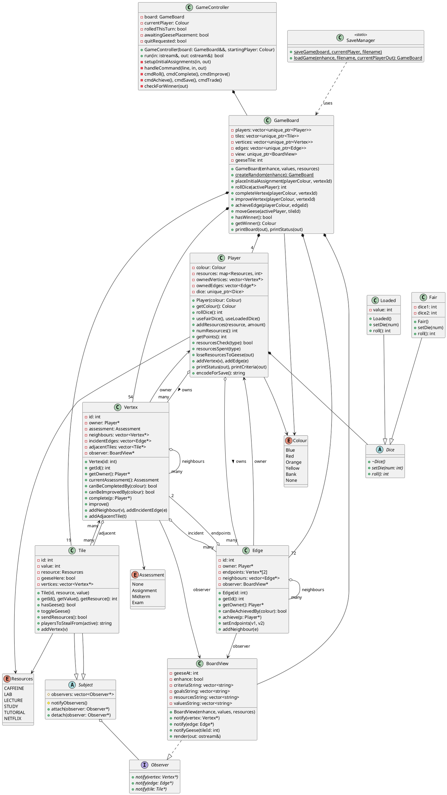

# Watan Game - UML Class Diagram

## Class Diagram (PlantUML Format)

## Architecture Overview

### **Core Game Flow**
1. **GameController** orchestrates the game loop
2. **GameBoard** manages game state and enforces rules
3. **Player** tracks resources, owned properties, and dice
4. **Vertex, Edge, Tile** represent the board graph

### **Design Patterns Used**

#### 1. **Observer Pattern**
- `Tile` inherits from `Subject`
- `BoardView` implements `Observer`
- Changes to tiles notify the view for real-time updates

#### 2. **Strategy Pattern**
- `Dice` interface with `Fair` and `Loaded` implementations
- Players can switch dice types at runtime

#### 3. **Factory Pattern**
- `GameBoard::createRandom()` creates randomized boards
- `GameBoard(values, resources)` for custom boards

#### 4. **Singleton-like Pattern**
- `SaveManager` provides static save/load methods

### **Memory Management**
- ✅ **Smart Pointers**: `unique_ptr` for ownership (Players, Tiles, Vertices, Edges, Dice, BoardView)
- ✅ **Raw Pointers**: Only for non-ownership references (adjacency, observers)
- ✅ **No Manual Memory**: Zero `new`/`delete` statements
- ✅ **RAII Compliance**: Full resource management via STL containers

### **Key Relationships**

| Relationship | Type | Description |
|--------------|------|-------------|
| GameBoard → Player | Composition | Board owns 4 players |
| GameBoard → Tile/Vertex/Edge | Composition | Board owns all graph elements |
| Player → Dice | Composition | Player owns their dice |
| Player → Vertex/Edge | Association | Player references owned properties |
| Tile → Subject | Inheritance | Tile is observable |
| BoardView → Observer | Implementation | View observes tile changes |
| Fair/Loaded → Dice | Inheritance | Dice implementations |

### **Bonus Features Implemented**
1. **Play Again** (GameController::run returns bool)
2. **Memory Management** (4 marks) - All smart pointers
3. **Color Enhancement** (2 marks) - BoardView enhance mode

---

## To Visualize
Copy the PlantUML code to:
- https://www.plantuml.com/plantuml/uml/
- VS Code with PlantUML extension
- Any PlantUML renderer

