# Watan Game - Updated UML Class Diagram

## PlantUML Code

```plantuml
@startuml Watan_Updated_Architecture

skinparam classAttributeIconSize 0
skinparam linetype ortho

' ========== MAIN CONTROLLER ==========
class GameController {
  - board: GameBoard
  - currentPlayer: Colour
  - rolledThisTurn: bool
  - awaitingGeesePlacement: bool
  - quitRequested: bool
  __
  + GameController(board: GameBoard&&)
  + GameController(board: GameBoard&&, startingPlayer: Colour)
  + run(in: istream&, out: ostream&): bool
  __
  - setupInitialAssignments(in, out)
  - handleCommand(line, in, out)
  - cmdRoll(), cmdComplete(), cmdImprove()
  - cmdAchieve(), cmdSave(), cmdTrade()
  - cmdSetFairDice(), cmdSetLoadedDice()
  - cmdHelp(), cmdBoard(), cmdStatus()
  - checkForWinner(out)
}

' ========== GAME BOARD ==========
class GameBoard {
  - players: vector<unique_ptr<Player>>
  - tiles: vector<unique_ptr<Tile>>
  - vertices: vector<unique_ptr<Vertex>>
  - edges: vector<unique_ptr<Edge>>
  - view: unique_ptr<BoardView>
  - geeseTile: int
  __
  + GameBoard(enhance, values, resources)
  + {static} createRandom(enhance): GameBoard
  + placeInitialAssignment(colour, vertexId)
  + rollDice(activePlayer): int
  + completeVertex(colour, vertexId)
  + improveVertex(colour, vertexId)
  + achieveEdge(colour, edgeId)
  + moveGeese(activePlayer, tileId)
  + hasWinner(): bool
  + getWinner(): Colour
  + printBoard(out), printStatus(out)
  + getPlayer(colour): Player*
  + encodeBoardLayoutForSave(): string
}

' ========== PLAYER ==========
class Player {
  - colour: Colour
  - resources: map<Resources, int>
  - ownedVertices: vector<Vertex*>
  - ownedEdges: vector<Edge*>
  - dice: unique_ptr<Dice>
  __
  + Player(colour: Colour)
  + getColour(): Colour
  + rollDice(): int
  + useFairDice(), useLoadedDice()
  + isLoadedDice(): bool
  + setLoadedRoll(value)
  + addResources(resource, amount)
  + numResources(): int
  + getPoints(): int
  + resourcesCheck(type): bool
  + resourcesSpent(type)
  + loseResourcesToGeese(out)
  + addVertex(v), addEdge(e)
  + printStatus(out), printCriteria(out)
  + encodeForSave(): string
}

' ========== BOARD ELEMENTS ==========
class Vertex {
  - id: int
  - owner: Player*
  - assessment: Assessment
  - neighbours: vector<Vertex*>
  - incidentEdges: vector<Edge*>
  - adjacentTiles: vector<Tile*>
  - observer: BoardView*
  __
  + Vertex(id: int)
  + getId(): int
  + getOwner(): Player*
  + getOwnerColour(): Colour
  + currentAssessment(): Assessment
  + isOccupied(): bool
  + canBeCompletedBy(colour): bool
  + canBeImprovedBy(colour): bool
  + complete(p: Player*)
  + improve()
  + addNeighbour(v), addIncidentEdge(e)
  + addAdjacentTile(t)
  + attach(view: BoardView*)
}

class Edge {
  - id: int
  - owner: Player*
  - endpoints: Vertex*[2]
  - neighbours: vector<Edge*>
  - observer: BoardView*
  __
  + Edge(id: int)
  + getId(): int
  + getOwner(): Player*
  + getOwnerColour(): Colour
  + canBeAchievedBy(colour): bool
  + achieve(p: Player*)
  + setEndpoints(v1, v2)
  + addNeighbour(e)
  + attach(view: BoardView*)
}

class Tile {
  - id: int
  - value: int
  - resource: Resources
  - geeseHere: bool
  - vertices: vector<Vertex*>
  __
  + Tile(id, resource, value)
  + getId(), getValue(), getResource(): int
  + hasGeese(): bool
  + toggleGeese()
  + sendResources(): bool
  + playersToStealFrom(active: Colour): string
  + addVertex(v: Vertex*)
}

' ========== VIEW ==========
class BoardView {
  - geeseAt: int
  - enhance: bool
  - criteriaString: vector<string>
  - goalsString: vector<string>
  - resourcesString: vector<string>
  - valuesString: vector<string>
  - tileNumberString: vector<string>
  __
  + BoardView(enhance, values, resources)
  + notify(vertex: Vertex*)
  + notify(edge: Edge*)
  + notifyGeese(tileId: int)
  + render(out: ostream&)
}

' ========== OBSERVER PATTERN ==========
abstract class Subject {
  # observers: vector<Observer*>
  __
  # notifyObservers()
  + attach(observer: Observer*)
  + detach(observer: Observer*)
  + {abstract} ~Subject()
}

interface Observer {
  + {abstract} notify(vertex: Vertex*)
  + {abstract} notify(edge: Edge*)
  + {abstract} notify(tile: Tile*)
}

' ========== DICE HIERARCHY ==========
abstract class Dice {
  + {abstract} ~Dice()
  + {abstract} setDie(num: int)
  + {abstract} roll(): int
}

class Fair {
  - dice1: int
  - dice2: int
  __
  + Fair()
  + setDie(num)
  + roll(): int
}

class Loaded {
  - value: int
  __
  + Loaded()
  + setDie(num)
  + roll(): int
}

' ========== SAVE/LOAD ==========
class SaveManager <<static>> {
  + {static} saveGame(board, currentPlayer, filename)
  + {static} loadGame(enhance, filename, currentPlayerOut): GameBoard
}

' ========== ENUMS ==========
enum Colour {
  Blue
  Red
  Orange
  Yellow
  Bank
  None
}

enum Resources {
  CAFFEINE
  LAB
  LECTURE
  STUDY
  TUTORIAL
  NETFLIX
}

enum Assessment {
  None
  Assignment
  Midterm
  Exam
}

' ========== RELATIONSHIPS ==========

' Controller owns GameBoard
GameController *-- GameBoard : owns

' GameBoard composition
GameBoard *-- "4" Player : owns
GameBoard *-- "19" Tile : owns
GameBoard *-- "54" Vertex : owns
GameBoard *-- "72" Edge : owns
GameBoard *-- BoardView : owns

' Player composition and associations
Player *-- Dice : owns
Player o-- "0..*" Vertex : references >
Player o-- "0..*" Edge : references >

' Vertex relationships
Vertex --> Player : owner
Vertex o-- "0..*" Vertex : neighbours
Vertex o-- "0..*" Edge : incident
Vertex o-- "0..*" Tile : adjacent
Vertex --> BoardView : observer

' Edge relationships
Edge --> Player : owner
Edge o-- "2" Vertex : endpoints
Edge o-- "0..*" Edge : neighbours
Edge --> BoardView : observer

' Tile relationships
Tile o-- "0..*" Vertex : adjacent
Tile --|> Subject : extends

' Observer pattern
BoardView ..|> Observer : implements
Subject o-- Observer : notifies

' Dice hierarchy
Fair --|> Dice : extends
Loaded --|> Dice : extends

' SaveManager uses GameBoard
SaveManager ..> GameBoard : uses
SaveManager ..> Player : uses

' Enums
Player --> Colour : uses
Player --> Resources : uses
Vertex --> Assessment : uses
Tile --> Resources : uses
GameBoard --> Colour : uses
GameController --> Colour : uses

@enduml
```

## Architecture Summary

### **Design Patterns**

1. **Observer Pattern**
   - `Tile` extends `Subject`
   - `BoardView` implements `Observer`
   - Vertices and Edges notify BoardView of state changes

2. **Strategy Pattern**
   - `Dice` abstract class
   - `Fair` and `Loaded` concrete implementations
   - Players can switch dice types at runtime

3. **Factory Method Pattern**
   - `GameBoard::createRandom()` creates randomized boards
   - `GameBoard(values, resources)` for custom board layouts

4. **Facade Pattern**
   - `GameController` provides high-level game interface
   - Hides complexity of GameBoard operations

### **Memory Management (4 Bonus Marks)** ✅
- **100% Smart Pointers**: All ownership via `unique_ptr`
  - `GameBoard` owns: `Player`, `Tile`, `Vertex`, `Edge`, `BoardView`
  - `Player` owns: `Dice`
- **Raw Pointers**: Only for non-ownership references
  - Adjacency relationships (vertices, edges, tiles)
  - Observer references
- **Zero `new`/`delete` statements**
- **Full RAII compliance**

### **Color Enhancement (2 Bonus Marks)** ✅
- `BoardView` supports `-enhance` flag
- ANSI color codes for player pieces on board
- Colors: Blue (33), Red (196), Orange (208), Yellow (226)
- Plain text for player names (colors only on board display)

### **Play Again Feature** ✅
- `GameController::run()` returns `bool`
- `true` = play again, `false` = quit
- `main.cc` implements game loop

### **Key Class Counts**
- **4 Players** (Blue, Red, Orange, Yellow)
- **19 Tiles** (resource hexagons)
- **54 Vertices** (intersections/criteria)
- **72 Edges** (paths/goals)

---

## To Visualize

Copy the PlantUML code to:
- **https://www.plantuml.com/plantuml/uml/**
- VS Code with PlantUML extension
- IntelliJ IDEA with PlantUML plugin

